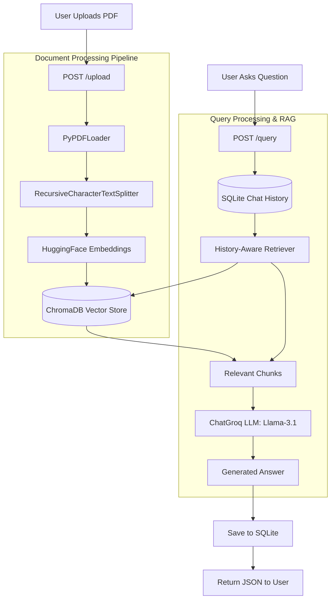

# Implementation Part 1: Backend (Intelligent RAG Chatbot)

This document serves as the project report and documentation for **Phase 1** of our capstone project: the development of the Retrieval-Augmented Generation (RAG) backend API.

---

## 1. Project Initiation & Planning

We started the process by closely analyzing the project synopsis, which outlined the need for an intelligent chatbot that grounds its responses in uploaded PDF documents. 

Our implementation plan for the backend was divided into clear steps:
1. **Define the Tech Stack**: We chose **FastAPI** for its speed and native async support, **LangChain** for orchestrating the RAG pipeline, and **ChromaDB** for local vector storage.
2. **Setup the Environment**: Create a virtual environment and define dependencies.
3. **Database Setup**: Implement a SQLite database using SQLAlchemy to store chat histories persistently, assigning each session a unique `session_id`.
4. **RAG Pipeline**: Build the core logic to load PDFs, chunk text, embed it using HuggingFace models, and retrieve relevant chunks to feed into the Groq API (running the `llama-3.1-8b-instant` model).
5. **API Endpoints**: Expose `/upload`, `/query`, and `/history` endpoints.

---

## 2. Dependencies

The project relies on a robust set of open-source libraries defined in `backend/requirements.txt`:

```text
fastapi                  # High-performance web framework for APIs
uvicorn                  # ASGI server to run FastAPI
langchain                # Framework for developing LLM applications
langchain-classic        # Legacy chain implementations (e.g. create_retrieval_chain)
langchain-community      # Third-party integrations
langchain-huggingface    # Local embeddings (Sentence Transformers)
langchain-groq           # Cloud LLM provider integration
chromadb                 # Lightweight, local vector database
sentence-transformers    # Model to convert text into vector embeddings
pypdf                    # PDF parsing and text extraction
python-multipart         # Required by FastAPI for handling file uploads
sqlalchemy               # ORM for interacting with the SQLite database
```

---

## 3. Core Architecture Flow

Below is a Mermaid diagram illustrating the flow of data through our backend.



---

## 4. Key Files & Implementation Details

### A. Database Configuration (`backend/database.py` & `backend/models.py`)

We used SQLAlchemy to set up a lightweight SQLite database (`chat_history.db`). This ensures that user conversations are not lost when the frontend reloads.

```python
# snippet from models.py
class ChatMessage(Base):
    __tablename__ = "chat_messages"

    id = Column(Integer, primary_key=True, index=True)
    session_id = Column(String, index=True)
    role = Column(String) # 'user' or 'assistant'
    content = Column(Text)
    created_at = Column(DateTime(timezone=True), server_default=func.now())
```

### B. The RAG Engine (`backend/rag_pipeline.py`)

This file contains the heart of the RAG system. It initializes the `sentence-transformers/all-MiniLM-L6-v2` embedding model and configures the Chroma database.

**Document Chunking Snippet:**
```python
def process_pdf(file_path: str):
    loader = PyPDFLoader(file_path)
    documents = loader.load()
    
    # Split text into 1000-character chunks with 200-character overlap
    text_splitter = RecursiveCharacterTextSplitter(chunk_size=1000, chunk_overlap=200)
    chunks = text_splitter.split_documents(documents)
    
    vector_store.add_documents(chunks)
    return len(chunks)
```

**Conversational Chain Snippet:**
We used `create_history_aware_retriever` to ensure the LLM understands follow-up questions by contextualizing them against the chat history before querying the vector store.
```python
def get_rag_chain():
    retriever = vector_store.as_retriever(search_kwargs={"k": 3})
    
    # ... prompt setup omitted for brevity ...
    
    history_aware_retriever = create_history_aware_retriever(
        llm, retriever, contextualize_q_prompt
    )
    question_answer_chain = create_stuff_documents_chain(llm, qa_prompt)

    return create_retrieval_chain(history_aware_retriever, question_answer_chain)
```

### C. The API Layer (`backend/main.py`)

The FastAPI application ties everything together. It handles CORS so our future React frontend can communicate with it securely, and exposes the REST endpoints.

**Query Endpoint Snippet:**
```python
@app.post("/query")
def query_chatbot(request: QueryRequest, db: Session = Depends(get_db)):
    # 1. Fetch chat history from SQLite
    history_records = db.query(models.ChatMessage).filter(...)
    
    # 2. Save new user question
    # ...
    
    # 3. Invoke RAG chain
    rag_chain = get_rag_chain()
    response = rag_chain.invoke({
        "input": request.question,
        "chat_history": chat_history
    })
    
    # 4. Save assistant answer
    # ...
    
    return {"answer": response["answer"]}
```

---

## 5. Next Steps

With Phase 1 complete and thoroughly tested, the backend correctly parses PDFs, builds vector embeddings, and leverages open-source LLMs via the Groq API to provide grounded answers. 

**Phase 2** will focus on building the React frontend, designing a beautiful chat interface, and integrating it with these endpoints.
